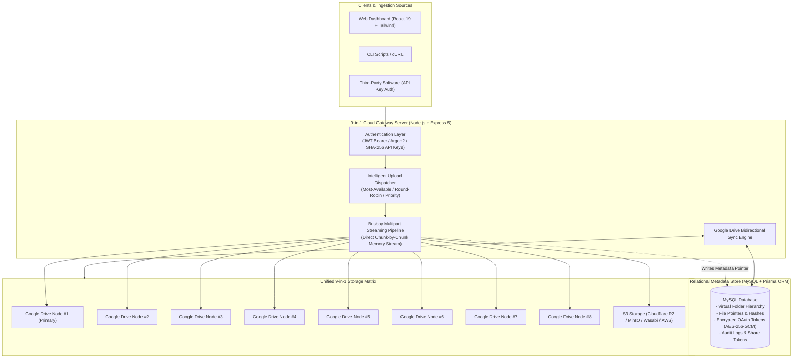

<div align="center">

# ⚡ 9-in-1 Cloud Storage Gateway

**The Unified Multi-Cloud Storage Pooling & Intelligent Stream Gateway**

*Aggregate up to 9 Google Drive & S3 cloud accounts into one seamless, high-performance virtual storage pool with zero server disk buffering.*

<br/>

[](https://smartworldarafath.github.io/9-in-1-Cloud/)
[](LICENSE)

<br/>

[](https://nodejs.org/)
[](https://www.typescriptlang.org/)
[](https://react.dev/)
[](https://www.docker.com/)
[](https://github.com/smartworldarafath/9-in-1-Cloud/pulls)
[](https://github.com/smartworldarafath/9-in-1-Cloud)

<br/>

[🚀 **Explore Live Interactive Demo**](https://smartworldarafath.github.io/9-in-1-Cloud/) • [📖 **Architecture Deep-Dive**](#-system-architecture--how-it-works) • [🛠️ **Setup Guide**](#-quick-start--installation) • [📡 **API Documentation**](#-api-upload-reference) • [☕ **Support**](#-support--buy-me-a-coffee)

<br/>


</div>

---

## 🌐 Live Interactive Demo

Experience how 9 cloud accounts connect and merge into a single storage pool in real-time directly in your web browser:

👉 **[Launch 9-in-1 Cloud Interactive Demo](https://smartworldarafath.github.io/9-in-1-Cloud/)**

*Features of the live demo:*
- **Real-Time Storage Pooling**: Experience 9 Google Drive accounts combined into a single virtual pool.
- **Quota Tracker**: Inspect live space utilization meters and per-drive quotas.
- **Virtual File Manager**: Test file browsing, folder navigation, search filtering, and preview modals.
- **Functional Settings**: Smooth dark/light mode toggle and local self-host gateway connection tester.

---

## 📌 Executive Overview & Core Problem Solved

### The Cloud Storage Fragmentation Problem
Most individual users, developers, and small teams own multiple Google accounts (e.g., personal, work, client, university, backup accounts). Each free Google account offers **15 GB** of free cloud storage, but managing them is painful:
- You must constantly switch browser profiles and logins.
- Large files cannot span across accounts.
- One account quickly runs out of space while another account sits virtually empty.
- Traditional VPS gateway software downloads files onto the host server disk before uploading to cloud storage, risking disk exhaustion, slow transfer rates, and disk I/O bottlenecks.

### The 9-in-1 Cloud Solution
**9-in-1 Cloud** is a specialized, open-source **reverse-proxy storage gateway and virtualization layer**. It connects up to **9 Google Drive accounts** (and optional enterprise S3 buckets like Cloudflare R2, MinIO, Wasabi, or AWS) into a single, unified virtual drive:
1. **135 GB+ Pooled Storage**: Connect 9 free Google Drive accounts (15 GB each) to immediately yield **135.00 GB** of zero-cost cloud storage.
2. **Direct Memory Stream Pipeline**: File uploads and downloads stream straight through memory chunks without ever storing or caching physical files on the host server disk.
3. **Dynamic Load Balancing**: The gateway evaluates the remaining space on each connected drive in real time and automatically dispatches incoming files to the emptiest account.
4. **Single MySQL Virtual Directory**: Users see one clean, unified directory hierarchy with virtual folders, search, tags, and shareable links regardless of which physical Google Drive account holds the file.

---

## 🏗️ System Architecture & How It Works



### The Zero-Disk Streaming Mechanics
When a user uploads a 2 GB video file:
1. The client sends a `POST /files/upload` multipart stream.
2. Express pipes the request body into `Busboy` on the fly.
3. The **Intelligent Dispatcher** inspects the database to find the connected Google Drive account with the highest free quota.
4. An active OAuth2 client is retrieved (refreshing access tokens automatically if expired).
5. The incoming file chunk stream is piped directly into the Google Drive API v3 `drive.files.create({ media: { body: fileStream } })`.
6. **Zero bytes of the uploaded file are saved to the server's local hard drive.** The file streams straight from the client's socket into Google's cloud servers.
7. Once Google returns the remote file ID and size, a corresponding record is written to MySQL, mapping the virtual folder path to the remote physical file.

---

## 🎯 Upload Routing Algorithms Explained

9-in-1 Cloud offers three selectable routing strategies configured in settings:

### 1. Most-Available Space (Default & Recommended)
```typescript
// Algorithm: Find account where (totalBytes - usedBytes) is maximized
let targetAccount = connectedAccounts.reduce((best, curr) => {
  const currAvailable = BigInt(curr.totalBytes) - BigInt(curr.usedBytes);
  const bestAvailable = BigInt(best.totalBytes) - BigInt(best.usedBytes);
  return currAvailable > bestAvailable ? curr : best;
});
```
- **Behavior**: Ensures balanced distribution across all 9 accounts. If one drive gets heavy use, incoming uploads seamlessly divert to the emptier accounts.

### 2. Round-Robin
```typescript
// Algorithm: Atomic modulo counter across connected accounts
const index = currentCursor % connectedAccounts.length;
const targetAccount = connectedAccounts[index];
currentCursor++;
```
- **Behavior**: Cycles sequentially from Account #1 to #9. Best for scenarios where files have similar sizes and you want an even count of files per account.

### 3. Priority Order
```typescript
// Algorithm: Fills account #1 until remaining space < incoming file size
let targetAccount = priorityList.find(acc => (acc.totalBytes - acc.usedBytes) >= incomingFileSize);
```
- **Behavior**: Fills your primary Drive first until it reaches 95% capacity, then overflows to Drive #2, then #3, etc.

---

## ✨ Core Capabilities & Features

| Capability | Technical Implementation | Benefit |
| :--- | :--- | :--- |
| **9-in-1 Storage Matrix** | Multi-account OAuth2 token lifecycle management | Connect up to 9 Google Drive accounts + S3 endpoints into one 135 GB+ pool. |
| **Zero Server Disk Caching** | Node.js Stream pipeline & Busboy stream parsing | Upload gigabyte-sized files without exhausting VPS disk space or RAM. |
| **S3 Storage Support** | AWS SDK v3 Client-S3 with custom endpoints | Connect MinIO, Cloudflare R2, Wasabi, Backblaze B2, or AWS S3 as overflow nodes. |
| **Virtual Folder Hierarchy** | Recursive MySQL schema with parent-child IDs | Create deeply nested folders without creating messy folder structures on Google Drive. |
| **Bidirectional Sync** | `POST /files/sync-google` differential comparator | Files manually placed in Google Drive's `9drive` folder are auto-indexed into MySQL. |
| **API Key System** | SHA-256 hashed keys, one-time secret display | Upload files headlessly from CI/CD pipelines, bash scripts, and backend microservices. |
| **Enterprise Security** | AES-256-GCM encrypted OAuth tokens, Argon2 password hashing | Stored credentials cannot be decrypted even if the database file is accessed. |
| **In-App Media Player** | Stream range requests (`bytes=0-`) via Plyr.js | Watch high-definition videos and preview images directly from your virtual storage. |
| **Automated Updates** | Native PM2 updater in Settings UI | Trigger zero-downtime updates directly from the dashboard via `update.sh`. |

---

## 📸 Screenshots & UI Preview

<div align="center">
  
  
</div>

---

## 📂 Codebase & Directory Structure

```txt
9-in-1-Cloud/
├── .github/
│   └── workflows/
│       └── pages.yml                 # Automated GitHub Pages deployment pipeline
├── backend/                          # Express 5 REST API & Cloud Gateway
│   ├── prisma/
│   │   ├── schema.prisma             # Full relational database schema definition
│   │   └── migrations/               # Versioned SQL migrations for MySQL
│   ├── src/
│   │   ├── config/
│   │   │   ├── env.ts                # Zod runtime environment variable validation
│   │   │   └── prisma.ts             # Prisma ORM singleton client
│   │   ├── middleware/
│   │   │   ├── auth.middleware.ts    # JWT verification and user session injection
│   │   │   ├── api-key.middleware.ts # External API key header validation & usage tracking
│   │   │   └── error.middleware.ts   # Centralized error handler
│   │   ├── modules/
│   │   │   ├── auth/                 # User registration, Argon2 login, and Google sign-in
│   │   │   ├── files/                # Upload, stream, rename, move, delete & sync logic
│   │   │   ├── folders/              # Virtual folder creation, renaming, tree traversal
│   │   │   ├── google/               # Google Drive API v3 OAuth and chunk streamer
│   │   │   ├── s3/                   # S3 client wrapper for MinIO, R2, Wasabi, AWS
│   │   │   ├── storage/              # Storage quota aggregation and routing policies
│   │   │   ├── api-keys/             # API key generation, hashing, and revocation
│   │   │   └── system/               # System health checks and PM2 update trigger
│   │   └── server.ts                 # Express application entry point
│   └── package.json
├── frontend/                         # React 19 + Vite 8 Single Page App
│   ├── src/
│   │   ├── components/
│   │   │   ├── drive/                # FileGrid, FileTable, FolderGrid, Quota visualizers
│   │   │   └── ui/                   # Button, Card, Modal, and Dialog primitives
│   │   ├── context/
│   │   │   ├── UploadContext.tsx     # Global background upload queue manager
│   │   │   └── StorageContext.tsx    # Live quota state and refresh triggers
│   │   ├── pages/
│   │   │   ├── AllFilesPage.tsx      # Main virtual file manager view
│   │   │   ├── QuotaTrackerPage.tsx  # Multi-account quota tracking and node health
│   │   │   ├── SettingsPage.tsx      # Routing policy, credentials, and PM2 updates
│   │   │   └── SharedPage.tsx        # File sharing and collaborator management
│   │   └── style.css                 # Custom glassmorphic styling and Tailwind utilities
│   └── vite.config.ts
├── docs/                             # Interactive GitHub Pages Live Demo
│   ├── index.html                    # Standalone real-time simulator and visualizer
│   └── assets/                       # Support QR codes and icons
├── docker-compose.yml                # Multi-container orchestration (API + Frontend + MySQL)
├── setup.ps1                         # PowerShell automated setup script (Windows)
├── setup.sh                          # Bash automated setup script (Linux/macOS)
└── LICENSE                           # Apache 2.0 Open-Source License
```

---

## 🚀 Quick Start & Installation

### System Prerequisites
- **Node.js**: `20.x` or higher
- **npm**: `10.x` or higher
- **MySQL**: `8.0+` (or run via Docker)
- **Google Cloud Console**: OAuth 2.0 Client ID & Client Secret (Google Drive API enabled)

---

### Option A: Automated Script Installation (Recommended)

The automated script configures local `.env` files with secure cryptographically random secrets, installs dependencies, and prepares Prisma ORM.

#### On Windows (PowerShell):
```powershell
# 1. Clone the repository
git clone https://github.com/smartworldarafath/9-in-1-Cloud.git
cd 9-in-1-Cloud

# 2. Run the automated PowerShell installer
powershell -ExecutionPolicy Bypass -File .\setup.ps1
```

#### On Linux / macOS (Bash):
```bash
# 1. Clone the repository
git clone https://github.com/smartworldarafath/9-in-1-Cloud.git
cd 9-in-1-Cloud

# 2. Make executable and run setup script
chmod +x ./setup.sh
./setup.sh
```

---

### Option B: Docker & Docker Compose (Zero Configuration)

Deploy the complete stack (Backend API, React Frontend, and MySQL 8 database) with a single command:

```bash
# 1. Create your environment configuration from the template
cp .env.docker.example .env

# 2. Start all containers in the background
docker compose up -d --build

# 3. Check container health status
docker compose ps
```

Once started:
- **Frontend Dashboard**: `http://localhost:5173`
- **Backend API Gateway**: `http://localhost:4000`
- **MySQL Database**: `localhost:3306`

---

## ⚙️ Environment Configuration Reference

### Backend (`backend/.env`)
| Variable | Default Value | Description |
| :--- | :--- | :--- |
| `PORT` | `4000` | HTTP port for the Express API gateway |
| `DATABASE_URL` | `mysql://root@localhost:3306/9drive` | Prisma MySQL database connection URI |
| `JWT_SECRET` | `[auto-generated-32-byte-hex]` | Secret key used to sign and verify user JWT sessions |
| `FRONTEND_URL` | `http://localhost:5173` | Allowed CORS origin for web dashboard requests |
| `GOOGLE_CLIENT_ID` | `[your-client-id].apps.googleusercontent.com` | Google Cloud OAuth 2.0 Client ID |
| `GOOGLE_CLIENT_SECRET` | `[your-client-secret]` | Google Cloud OAuth 2.0 Client Secret |
| `GOOGLE_REDIRECT_URI` | `http://localhost:4000/connected-accounts/google/callback` | OAuth redirect URI configured in Google Cloud Console |

### Frontend (`frontend/.env`)
| Variable | Default Value | Description |
| :--- | :--- | :--- |
| `VITE_API_URL` | `http://localhost:4000` | Target URL for backend API requests |

---

## 🔑 Google Cloud Console OAuth Setup Guide

To link your Google Drive accounts:
1. Open the [Google Cloud Console](https://console.cloud.google.com/).
2. Create a new project named **9-in-1 Cloud**.
3. Go to **APIs & Services > Library**, search for **Google Drive API**, and click **Enable**.
4. Navigate to **APIs & Services > OAuth consent screen**:
   - Choose **External**.
   - Fill in the App Name (`9-in-1 Cloud`) and your email address.
   - Add the scope: `.../auth/drive` (Full access to create and manage the dedicated `9drive` folder).
5. Navigate to **APIs & Services > Credentials**:
   - Click **Create Credentials > OAuth Client ID**.
   - Select **Web application**.
   - In **Authorized JavaScript origins**, add: `http://localhost:5173` (or your domain).
   - In **Authorized redirect URIs**, add: `http://localhost:4000/connected-accounts/google/callback`.
6. Copy the generated **Client ID** and **Client Secret** into your backend configuration or enter them directly inside the **Settings** UI of the dashboard.

---

## 📡 API Upload Reference

You can stream uploads directly into your unified 9-in-1 cloud storage pool from third-party applications, CLI tools, or automated scripts using an API Key.

### 1. Upload via cURL
```bash
curl -X POST "http://localhost:4000/api/v1/uploads" \
  -H "X-API-Key: your_generated_api_key_here" \
  -F "file=@/path/to/large-backup-file.zip" \
  -F "folderId=optional-virtual-folder-id"
```

### 2. Upload via JavaScript (Fetch / Node.js)
```javascript
const formData = new FormData();
formData.append('file', fileBlob, 'application-build.tar.gz');

const response = await fetch('http://localhost:4000/api/v1/uploads', {
  method: 'POST',
  headers: {
    'X-API-Key': 'your_generated_api_key_here'
  },
  body: formData
});

const result = await response.json();
console.log('Upload completed:', result);
// Output includes: { fileId, name, size, targetDriveAccount, streamStatus: 'synced' }
```

---

## ☕ Support / Buy Me a Coffee

If you find **9-in-1 Cloud** helpful and want to support ongoing development, maintenance, and new features, consider buying me a coffee! Your support means the world and helps keep this project open-source.

<div align="center">

<a href="https://www.supportkori.com/arafathrahman" target="_blank">
  
</a>

<br/><br/>

<a href="https://www.supportkori.com/arafathrahman" target="_blank">
  
</a>

<br/><br/>

Scan the QR code above or visit:  
👉 **[https://www.supportkori.com/arafathrahman](https://www.supportkori.com/arafathrahman)**

</div>

---

## 🤝 Contributing

Contributions, bug reports, and enhancements are always welcome!
1. Fork the Project (`https://github.com/smartworldarafath/9-in-1-Cloud/fork`)
2. Create your Feature Branch (`git checkout -b feature/NewCapability`)
3. Commit your Changes (`git commit -m 'Add NewCapability'`)
4. Push to the Branch (`git push origin feature/NewCapability`)
5. Open a Pull Request

---

## 📄 License & Copyright

Distributed under the **Apache License, Version 2.0**. See the [LICENSE](LICENSE) file for complete details.

Copyright © 2026 **Arafath**. All rights reserved.
