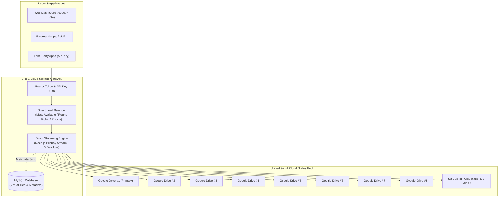

<div align="center">

# ⚡ 9-in-1 Cloud Storage Gateway

**The Unified Multi-Cloud Storage Pooling & Intelligent Stream Gateway**

*Aggregate up to 9 Google Drive & S3 cloud accounts into one seamless, high-performance virtual storage pool with zero server disk buffering.*

<br/>

[](https://smartworldarafath.github.io/9-in-1-Cloud/)
[](LICENSE)

<br/>

[](https://nodejs.org/)
[](https://www.typescriptlang.org/)
[](https://react.dev/)
[](https://www.docker.com/)
[](https://github.com/smartworldarafath/9-in-1-Cloud/pulls)
[](https://github.com/smartworldarafath/9-in-1-Cloud)

<br/>

[🚀 **Explore Live Interactive Demo**](https://smartworldarafath.github.io/9-in-1-Cloud/) • [📖 **Documentation**](#-quick-start) • [✨ **Features**](#-core-capabilities) • [🛠️ **API Reference**](#-api-upload-endpoint)

<br/>


</div>

---

## 🌐 Live Interactive Demo

Experience how 9 cloud accounts connect and merge into a single storage pool in real-time:

👉 **[Launch 9-in-1 Cloud Interactive Demo](https://smartworldarafath.github.io/9-in-1-Cloud/)**

*Test simulated uploads, watch the intelligent dispatch algorithm route chunks to the cloud account with the highest free quota, inspect virtual folders, and ping cloud nodes directly in your browser.*

---

## 📌 Overview

**9-in-1 Cloud** is a modern storage gateway web application engineered to bridge and unify multiple cloud storage providers (including up to **9 Google Drive accounts** and **S3-compatible buckets** like Cloudflare R2, MinIO, Wasabi, and AWS S3) into a single, cohesive virtual storage drive.

Instead of juggling multiple logins and fragmented folders, **9-in-1 Cloud** pools your accounts into one unified dashboard, dynamically balancing upload loads and maintaining a single virtual folder hierarchy.

### Why 9-in-1 Cloud?
- **Massive Free Storage Pool**: Combine 9 free Google Drive accounts (15 GB each) into a single **135 GB** virtual drive.
- **Zero Local Disk Footprint**: File uploads and downloads stream straight through memory chunks without ever caching or storing physical files on your host server disk.
- **Multi-Cloud Freedom**: Seamlessly combine Google Drive with enterprise S3 buckets (Cloudflare R2, MinIO, Wasabi, Backblaze B2).
- **Intelligent Auto-Routing**: Automatically directs incoming files to the cloud node with the most available free space.

---

## 🏗️ System Architecture



---

## ✨ Core Capabilities

| Feature | Description |
| :--- | :--- |
| 🔀 **Multi-Account Storage Matrix** | Connect up to 9 separate Google Drive accounts + unlimited S3-compatible endpoints in one unified dashboard. |
| ⚡ **Direct Stream Pipeline** | Stream files directly to cloud targets chunk-by-chunk. Zero server disk storage required. |
| 🎯 **Intelligent Upload Routing** | Configurable upload routing strategies: **Most-Available**, **Round-Robin**, or **Priority-Order**. |
| 📁 **Virtual Folder Hierarchy** | Organize files in virtual folder trees regardless of which physical cloud account stores the file. |
| 🔄 **Bidirectional Google Sync** | Auto-discover or manually sync files added directly inside the Google Drive `9drive` folder into MySQL. |
| 🔑 **API Key Management** | Issue and revoke external upload API keys with last-used tracking and hashed database storage. |
| 🔐 **Enterprise Security** | Bearer token authentication, Argon2 password hashing, and encrypted DB storage for Google OAuth secrets. |
| 👁️ **File Previews & Sharing** | Instant preview for images, documents, video streaming, and shareable public links. |
| 🐳 **Docker & PM2 Ready** | Turnkey deployment via `docker-compose.yml` or automated zero-downtime updates with PM2. |

---

## 📸 Screenshots

<div align="center">
  
  
</div>

---

## 🚀 Quick Start

### Prerequisites
- **Node.js**: `20.x` or higher
- **npm**: `10.x` or higher
- **MySQL**: `8.0+` (or run via Docker)
- **Google Cloud Console Project**: OAuth 2.0 Client ID & Secret (with Drive API enabled)

---

### Method 1: Automated Script Setup (Recommended)

The automated script configures local `.env` files with secure tokens, installs all dependencies, and compiles Prisma ORM schemas.

#### On Windows (PowerShell):
```powershell
# 1. Clone your repository
git clone https://github.com/smartworldarafath/9-in-1-Cloud.git
cd 9-in-1-Cloud

# 2. Run automated setup script
powershell -ExecutionPolicy Bypass -File .\setup.ps1
```

#### On Linux / macOS:
```bash
# 1. Clone your repository
git clone https://github.com/smartworldarafath/9-in-1-Cloud.git
cd 9-in-1-Cloud

# 2. Run automated setup script
bash ./setup.sh
```

---

### Method 2: Docker & Docker Compose

Deploy the complete stack (Backend API, Frontend Web UI, and MySQL 8) with one command:

```bash
# 1. Create environment file from template
cp .env.docker.example .env

# 2. Start all containers in background
docker compose up -d --build

# 3. Check container status
docker compose ps
```

* **Frontend**: `http://localhost:5173`
* **Backend API**: `http://localhost:4000`
* **MySQL Database**: `localhost:3306`

---

## ⚙️ Environment Configuration

### Backend (`backend/.env`)
| Variable | Default / Example | Purpose |
| :--- | :--- | :--- |
| `PORT` | `4000` | HTTP port for Express API |
| `DATABASE_URL` | `mysql://root@localhost:3306/9drive` | Prisma MySQL connection string |
| `JWT_SECRET` | `[auto-generated-32-byte-hex]` | Secret key for signing user session tokens |
| `FRONTEND_URL` | `http://localhost:5173` | Allowed CORS origin |
| `GOOGLE_CLIENT_ID` | `your-id.apps.googleusercontent.com` | Google OAuth Client ID |
| `GOOGLE_CLIENT_SECRET` | `your-google-client-secret` | Google OAuth Client Secret |
| `GOOGLE_REDIRECT_URI` | `http://localhost:4000/connected-accounts/google/callback` | OAuth redirect callback URL |

### Frontend (`frontend/.env`)
| Variable | Default / Example | Purpose |
| :--- | :--- | :--- |
| `VITE_API_URL` | `http://localhost:4000` | Target URL for backend API requests |

---

## 📡 API Upload Endpoint

You can upload files directly into your unified 9-in-1 cloud from scripts, CI/CD pipelines, or external apps using an API Key.

### Upload via cURL
```bash
curl -X POST "http://localhost:4000/api/v1/uploads" \
  -H "X-API-Key: your_generated_api_key_here" \
  -F "file=@/path/to/your-file.zip" \
  -F "folderId=optional-virtual-folder-id"
```

### Upload via JavaScript (Node.js / Fetch)
```javascript
const formData = new FormData();
formData.append('file', fileBlob, 'backup-archive.tar.gz');

const response = await fetch('http://localhost:4000/api/v1/uploads', {
  method: 'POST',
  headers: {
    'X-API-Key': 'your_generated_api_key_here'
  },
  body: formData
});

const result = await response.json();
console.log('File successfully stored in unified cloud:', result);
```

---

## 📂 Repository Structure

```txt
9-in-1-Cloud/
├── .github/
│   └── workflows/
│       └── pages.yml          # Automated GitHub Pages CI/CD
├── backend/                   # Express.js REST API & Streaming Gateway
│   ├── prisma/                # Prisma schema, migrations & seed scripts
│   ├── src/
│   │   ├── config/            # Database & OAuth config
│   │   ├── middleware/        # Authentication & Busboy stream parser
│   │   ├── modules/           # Auth, Files, Folders, S3 & Google Drive services
│   │   └── server.ts          # Server entry point
│   └── package.json
├── frontend/                  # React 19 + Vite Dashboard
│   ├── src/
│   │   ├── components/        # Modals, upload progress, file browser
│   │   ├── context/           # Auth, Storage, & Upload state providers
│   │   └── pages/             # Dashboard, Quota tracker, Settings
│   └── vite.config.ts
├── docs/                      # Standalone 9-in-1 Cloud Interactive Demo
│   └── index.html             # Real-time multi-cloud visualizer & simulator
├── docker-compose.yml         # Turnkey multi-container orchestration
├── setup.ps1                  # PowerShell automated setup script (Windows)
├── setup.sh                   # Bash automated setup script (Linux/macOS)
└── LICENSE                    # Apache 2.0 License
```

---

## 🤝 Contributing

Contributions, feature requests, and issue reports are welcomed!
1. Fork the Project
2. Create your Feature Branch (`git checkout -b feature/AmazingFeature`)
3. Commit your Changes (`git commit -m 'Add some AmazingFeature'`)
4. Push to the Branch (`git push origin feature/AmazingFeature`)
5. Open a Pull Request

---

## 📄 License & Copyright

Distributed under the **Apache License, Version 2.0**. See the [LICENSE](LICENSE) file for complete details.

Copyright © 2026 **Arafath**. All rights reserved.
